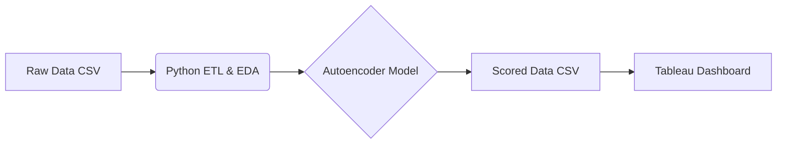

# 💳 Financial Fraud Detection: End-to-End Data Pipeline

Este directorio contiene la implementación técnica de un **pipeline de ingeniería de datos y machine learning** diseñado para detectar transacciones fraudulentas en tarjetas de crédito.

El proyecto abarca desde la ingesta y análisis exploratorio (EDA) de los datos crudos, pasando por el procesamiento ETL en Python, hasta la visualización de resultados de negocio en Tableau.

## 🏗️ Arquitectura del Pipeline

## 1. 🔍 Análisis Exploratorio de Datos (EDA)
Antes de procesar los datos, se realizó un análisis visual para comprender la naturaleza del dataset creditcard.csv.

Desafío Principal: El dataset presenta un desbalanceo extremo. Solo el 0.17% de las transacciones son fraudulentas.

Distribución de Montos: Se identificó que los montos (Amount) tienen una varianza muy alta, lo que requirió normalización logarítmica.

[Distribución de Clases](https://github.com/santiFie/Deep-Learning---2025/blob/main/Visualizaci%C3%B3n%20de%20Datos/Histograma.pdf)

## 2. 🐍 Python ETL & Modeling Pipeline
El script etl_pipeline.py orquesta todo el flujo de ingeniería de datos y modelado:

En la etapa de Wrangling, me enfoqué en la calidad de los datos de entrada: normalicé la distribución de los montos con np.log1p y apliqué escalado estándar (StandardScaler) para asegurar la estabilidad numérica del modelo.

Para el Modelado, implementé una estrategia de detección de anomalías. Entrené un Autoencoder para que se convierta en experto en reconstruir transacciones legítimas. De esta forma, utilizamos el Error de Reconstrucción (MSE) como indicador de riesgo: a mayor error de reconstrucción, mayor probabilidad de que la transacción sea fraudulenta.

El proceso concluye generando los insumos para la capa de inteligencia de negocios: un dataset transaccional con sus respectivos scores y un archivo auxiliar para graficar la curva Precision-Recall en Tableau.

## 3. 📊 Business Intelligence & Visualización (Tableau)
Los resultados del pipeline se integraron en Tableau para permitir la toma de decisiones basada en datos.
Esto lo realicé mediante un Box Plot de Dispersión (Log Scale) en donde se observa claramente cómo el modelo asigna errores significativamente más altos a los casos de fraude (azul) frente a las transacciones normales (naranja), validando la eficacia del Autoencoder.
